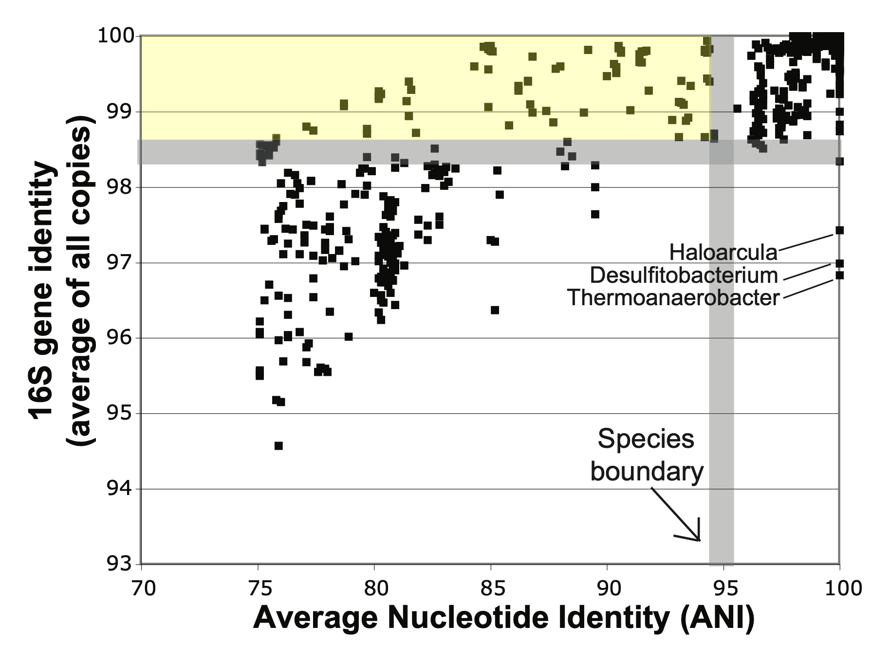

# Frequently Asked Questions

## *Do I need a genome sequence already?*
The most rigorous identification techniques require a genome sequence. However, we can help you estimate your strains' identities without one. Even better, we’d be happy to connect you to a wet lab that can sequence your bacterial sample. Once that’s done, we can get to work on identifying your strains’ species for you.
  

## *Can’t I just BLAST the 16S gene and take the top hit?*
It’s not advisable. BLAST does not use a curated database, so you’re likely to match entries with imprecise or outdated labels.
  

## *Can I use the 16S gene if I’m very careful about curation?*
The 16S gene can sometimes provide the correct identification, but without further analysis, it’s impossible to know if it’s accurate for *your* strain. For example, the figure below (adapted from Cole et al., 2010[^1]) highlights (in yellow) dozens of distinct species pairs with very different genomes that would be misidentified as being the same species when going by 16S alone.

Similarly, earlier research by Fox et al., 1992[^2] shows how species defined by classical methods may also appear identical by 16S. These findings underscore the limitations of 16S in precise species identification.

Image adapted from Cole et al, Figure 1.7.
  

## *Why worry about rigorous or up-to-date analysis?*
The reasons are twofold: protecting yourself and serving your customers.  

- **Serving your customers**: Delivering the most accurate information builds trust with your customers, the governmental agencies that regulate your industry, and your own team.
- **Protecting yourself**:  
   - Regulatory agencies often update their standards, becoming more stringent over time. A strain approved today with an inaccurate name could cause issues in the future.  
   - When assessing your freedom to operate, accurate identification can help your legal team determine whether patents or restrictions affect your work.  
   *(Note: We’re not lawyers—please consult a legal expert for advice on intellectual property and compliance.)*  
 

## *What about yogurt? Those companies were rigorous and still had to change their labels...*
It’s true. Sometimes even the most rigorous analyses can’t prevent changes in species names when scientific understanding evolves. For example, the genus *Lactobacillus* was long known to be overly broad and diverse. Its reclassification resulted in the need to update labels for many products[^3]. While science correcting itself is beautiful, it can be disruptive. As part of our analysis, we’ll flag organisms that could face similar reclassification issues in the near future.
  

## *Can you guarantee species identification from a genome?*
In most cases, yes, but there are exceptions. Challenges include:  
- **Genome quality**: Highly fragmented or contaminated genomes may require additional wet-lab work to improve quality.  
- **Novelty**: Occasionally, a strain is so novel that it’s too divergent from any previously published genomes for a definitive species name.  

Even if your strain falls into the latter category, we can guide you through the next steps in the identification process. Just let us know how we can help.
  

## *What are your rates?*
[Contact us](contact.md) to discuss your project and receive a customized quote.
  

# References
[^1]: Cole, J.R., Konstantinidis, K., Farris, F.J., & Tiedje, J.M. Microbial Diversity and Phylogeny: Extending from rRNAs to Genomes in Environmental Molecular Microbiology (ed. Liu, W.-T. & Jansson, J.K.) (Caister Academic Press, U.K., 2010) [(ResearchGate link)](https://www.researchgate.net/publication/285237823_Microbial_diversity_and_phylogeny_Extending_from_rRNAs_to_genomes)

[^2]: Fox, G.E., Wisotzkey, J.D., Jurtshuk Jr., P. How Close Is Close: 16S rRNA Sequence Identity May Not Be Sufficient To Guarantee Species Identity. *IJSEM* [(link)](https://doi.org/10.1099/00207713-42-1-166) (1992)

[^3]: Health Canada *Nomenclature changes to Lactobacillus.* [(link)](https://www.canada.ca/en/health-canada/services/food-nutrition/food-labelling/health-claims/microorganisms-term-probiotic/nomenclature-changes-lactobacillus.html) (2024)